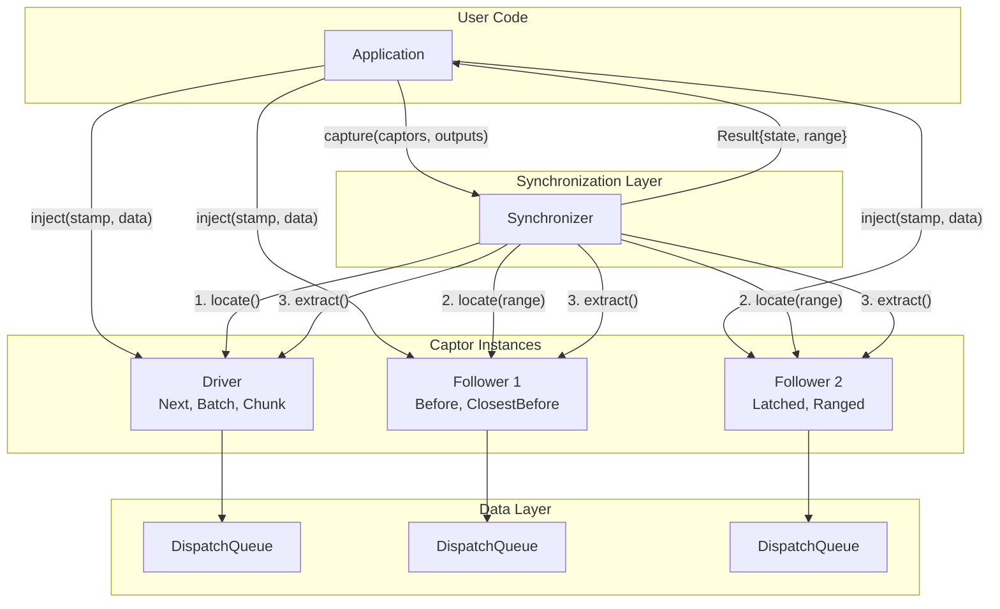
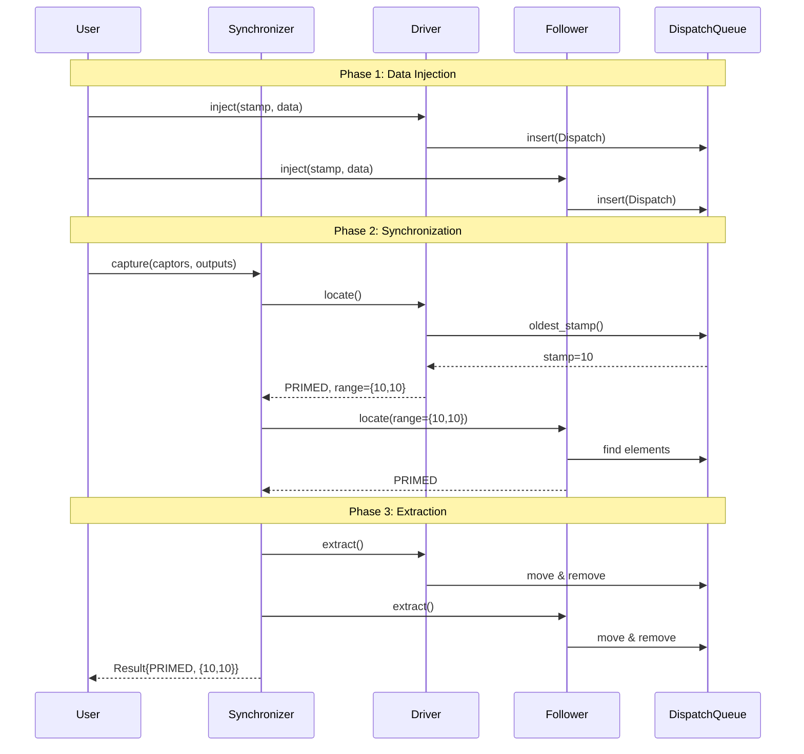

# Flow Library - Codebase Overview

> **C++14 Header-Only Library for Multi-Stream Data Synchronization**

This document serves as the primary onboarding guide for developers new to the Flow codebase. It provides a comprehensive overview of the architecture, core concepts, and practical usage patterns.

---

## Table of Contents

1. [Project Overview](#1-project-overview)
   - [Purpose and Functionality](#purpose-and-functionality)
   - [Key Problems Solved](#key-problems-solved)
   - [Real-World Use Case](#real-world-use-case)
2. [Technology Stack](#2-technology-stack)
   - [Languages and Standards](#languages-and-standards)
   - [Build Systems](#build-systems)
   - [Dependencies](#dependencies)
3. [Project Structure](#3-project-structure)
   - [Directory Layout](#directory-layout)
   - [Key Directories Explained](#key-directories-explained)
4. [Architecture](#4-architecture)
   - [Architectural Patterns](#architectural-patterns)
   - [Core Components](#core-components)
   - [Component Interaction Diagram](#component-interaction-diagram)
   - [Synchronization Flow Diagram](#synchronization-flow-diagram)
5. [Core Concepts](#5-core-concepts)
   - [Captors (Drivers and Followers)](#captors-drivers-and-followers)
   - [Dispatch Concept](#dispatch-concept)
   - [Threading Models](#threading-models)
   - [Synchronization States](#synchronization-states)
6. [Code Examples](#6-code-examples)
   - [Basic Synchronization](#example-1-basic-synchronization)
   - [Multi-Threaded with Blocking](#example-2-multi-threaded-with-blocking)
   - [Sliding Window (Batch)](#example-3-sliding-window-batch)
   - [Non-Overlapping Batches (Chunk)](#example-4-non-overlapping-batches-chunk)
   - [Latched State](#example-5-latched-state)
   - [Exact Timestamp Match](#example-6-exact-timestamp-match)
   - [Dry-Run with Locate](#example-7-dry-run-with-locate)
7. [Execution Trace: Complete Synchronization](#7-execution-trace-complete-synchronization)
8. [Configuration and Customization](#8-configuration-and-customization)
   - [Compile-Time Configuration](#compile-time-configuration)
   - [Custom Dispatch Types](#custom-dispatch-types)
   - [Queue Monitors](#queue-monitors)
9. [Error Handling](#9-error-handling)
10. [Building and Testing](#10-building-and-testing)
11. [Contributing](#11-contributing)

---

## 1. Project Overview

### Purpose and Functionality

**Flow** is a C++14 header-only library designed for synchronizing multiple streams of timestamped data. Originally developed by Fetch Robotics Inc. (now under ZebraDevs), it enables data-driven event execution using data collected from distinct streaming series.

### Key Problems Solved

| Problem | Flow's Solution |
|---------|-----------------|
| **Cross-stream correlation** | Determines which data elements from separate streams relate to each other using timestamp-based policies |
| **Readiness detection** | Knows when synchronized data is ready for capture using Driver-Follower pattern |
| **Uniform data capture** | Captures different data types with minimal overhead using generic Dispatch concept |

### Real-World Use Case

In robotics (ROS), multiple sensor streams (cameras, LiDAR, IMU) need synchronization:

```
┌─────────────┐     ┌─────────────┐     ┌─────────────┐
│ Camera Feed │     │ LiDAR Scan  │     │  IMU Data   │
│  (30 Hz)    │     │  (10 Hz)    │     │  (100 Hz)   │
└──────┬──────┘     └──────┬──────┘     └──────┬──────┘
       │                   │                   │
       └───────────────────┼───────────────────┘
                           │
                    ┌──────▼──────┐
                    │    Flow     │
                    │ Synchronizer│
                    └──────┬──────┘
                           │
                    ┌──────▼──────┐
                    │ Synchronized│
                    │ Data Frame  │
                    └─────────────┘
```

---

## 2. Technology Stack

### Languages and Standards

- **C++14** (strict requirement)
- Modern C++ features: CRTP, variadic templates, perfect forwarding
- Compiler flags: `-std=c++14 -Werror -Wall -Wextra`

### Build Systems

**CMake** (version 3.5+):
```bash
cmake -DBUILD_TESTS=ON .
make
ctest
```

**Bazel**:
```bash
bazel test test/... --test_output=all
```

### Dependencies

| Dependency | Purpose | Required |
|------------|---------|----------|
| C++14 Standard Library | Core functionality | Yes |
| GoogleTest | Unit testing | Tests only |
| clang-format-7 | Code formatting | Development |
| pre-commit | Git hooks | Development |

---

## 3. Project Structure

### Directory Layout

```
flow/
├── include/flow/           # Public API headers (THE LIBRARY)
│   ├── flow.hpp            # Main entry point
│   ├── captor.hpp          # Base captor interface
│   ├── synchronizer.hpp    # Synchronizer orchestrator
│   ├── dispatch.hpp        # Dispatch concept
│   ├── driver/             # Driver policies
│   ├── follower/           # Follower policies
│   ├── captor/             # Threading implementations
│   ├── impl/               # ⚠️ PRIVATE - Never include directly
│   └── utility/            # Template utilities
├── test/                   # GoogleTest test suite
│   └── flow/               # Tests mirror include structure
├── doc/                    # Diagrams for documentation
├── bazel/                  # Bazel build rules
├── cmake/                  # CMake configuration
└── .github/                # CI/CD workflows
```

### Key Directories Explained

| Directory | Role | Include Directly? |
|-----------|------|-------------------|
| `include/flow/` | Public API | ✅ Yes |
| `include/flow/impl/` | Implementation details | ❌ **NEVER** |
| `include/flow/driver/` | Driver capture policies | ✅ Yes |
| `include/flow/follower/` | Follower capture policies | ✅ Yes |
| `include/flow/captor/` | Threading implementations | ✅ Yes |
| `test/flow/` | Unit tests | N/A |

---

## 4. Architecture

### Architectural Patterns

Flow uses **Policy-Based Design** with **CRTP (Curiously Recurring Template Pattern)**:

```
ConcretePolicy (e.g., Next, Before)
       │
       ▼
Driver<Policy> or Follower<Policy>    ← CRTP Base
       │
       ▼
Captor<Derived, LockPolicy, Monitor>  ← Threading Implementation
       │
       ▼
CaptorInterface<Captor<...>>          ← Common Interface
```

**Benefits:**
- Zero runtime overhead (no virtual functions)
- Compile-time polymorphism
- Type-safe policy composition

### Core Components

| Component | Responsibility |
|-----------|----------------|
| **Synchronizer** | Orchestrates capture across captor tuples |
| **Driver** | Establishes synchronization time range |
| **Follower** | Selects data relative to driver's range |
| **DispatchQueue** | Ordered buffer for timestamped data |
| **Dispatch** | Timestamp + data payload wrapper |

### Component Interaction Diagram



### Synchronization Flow Diagram



---

## 5. Core Concepts

### Captors (Drivers and Followers)

**Drivers** establish the synchronization time range:

| Driver | Behavior | Use Case |
|--------|----------|----------|
| `driver::Next` | Captures oldest element | Frame-by-frame processing |
| `driver::Batch` | Captures N elements, removes oldest | Sliding window |
| `driver::Chunk` | Captures N elements, removes all | Non-overlapping batches |
| `driver::Throttled` | Rate-limited capture | Bandwidth control |

**Followers** select data relative to driver's range:

| Follower | Behavior | Use Case |
|----------|----------|----------|
| `follower::Before` | All elements before boundary | Historical context |
| `follower::ClosestBefore` | Single closest element | Nearest-neighbor matching |
| `follower::Latched` | Maintains last value | Configuration state |
| `follower::MatchedStamp` | Exact timestamp match | Strictly synchronized streams |
| `follower::Ranged` | Elements spanning range | All events in window |
| `follower::CountBefore` | N elements before boundary | Fixed history size |
| `follower::AnyBefore` | Optional (allows empty) | Non-critical streams |

### Dispatch Concept

Data must provide timestamp and value access:

```cpp
// Default dispatch template
template<typename StampT, typename ValueT>
class Dispatch {
public:
    StampT stamp;  // Sequencing timestamp
    ValueT value;  // Data payload
};

// For custom types, specialize traits:
namespace flow {
    template<> struct DispatchTraits<MyType> {
        using stamp_type = MyStamp;
        using value_type = MyValue;
    };
    
    template<> struct DispatchAccess<MyType> {
        static const MyStamp& stamp(const MyType& d) { return d.timestamp; }
        static const MyValue& value(const MyType& d) { return d.data; }
    };
}
```

### Threading Models

| Model | Lock Policy | Behavior |
|-------|-------------|----------|
| Single-threaded | `NoLock` | Zero overhead, polling |
| Multi-threaded blocking | `std::unique_lock<std::mutex>` | Waits until data ready |
| Multi-threaded polling | `Polling` | Thread-safe, non-blocking |

### Synchronization States

```cpp
enum class State {
    PRIMED,   // ✅ Data captured successfully
    RETRY,    // ⏳ Need more data, try again
    ABORT,    // ❌ Cannot synchronize, frame dropped
    TIMEOUT,  // ⏱️ Multi-threaded wait expired
    ERROR_DRIVER_LOWER_BOUND_EXCEEDED,  // 🚨 Timestamp violation
    SKIP_FRAME_QUEUE_PRECONDITION       // ⏭️ Queue monitor rejected
};
```

---

## 6. Code Examples

### Example 1: Basic Synchronization

```cpp
#include <flow/flow.hpp>
#include <vector>
#include <string>

using namespace flow;

// Define dispatch type
template<typename T>
using MyDispatch = Dispatch<int, T>;

int main() {
    // Create captors (single-threaded)
    driver::Next<MyDispatch<int>, NoLock> driver;
    follower::Before<MyDispatch<std::string>, NoLock> follower{5}; // delay=5
    
    // Inject data
    for (int t = 0; t < 100; ++t) {
        driver.inject(t, t * 10);
        follower.inject(t, "msg_" + std::to_string(t));
    }
    
    // Synchronization loop
    while (true) {
        std::vector<MyDispatch<int>> driver_data;
        std::vector<MyDispatch<std::string>> follower_data;
        
        auto [result, outputs] = Synchronizer::capture(
            std::forward_as_tuple(driver, follower),
            std::forward_as_tuple(
                std::back_inserter(driver_data),
                std::back_inserter(follower_data)
            )
        );
        
        if (result.state == State::PRIMED) {
            // Process synchronized data
            std::cout << "Synced at t=" << result.range.lower_stamp << "\n";
        } else if (result.state == State::RETRY) {
            break; // No more data
        }
    }
    return 0;
}
```

### Example 2: Multi-Threaded with Blocking

```cpp
#include <flow/flow.hpp>
#include <flow/captor/lockable.hpp>
#include <thread>
#include <atomic>

using namespace flow;
using namespace std::chrono_literals;

using StampType = std::chrono::steady_clock::time_point;
template<typename T>
using TimedDispatch = Dispatch<StampType, T>;

std::atomic<bool> running{true};

// Producer thread
void producer(driver::Next<TimedDispatch<double>, 
              std::unique_lock<std::mutex>>& driver) {
    while (running) {
        driver.inject(std::chrono::steady_clock::now(), 
                     read_sensor());
        std::this_thread::sleep_for(10ms);
    }
}

// Consumer thread  
void consumer(driver::Next<TimedDispatch<double>, 
              std::unique_lock<std::mutex>>& driver,
              follower::ClosestBefore<TimedDispatch<int>, 
              std::unique_lock<std::mutex>>& follower) {
    while (running) {
        std::vector<TimedDispatch<double>> d_data;
        std::vector<TimedDispatch<int>> f_data;
        
        // Blocking capture with 100ms timeout
        auto [result, _] = Synchronizer::capture(
            std::forward_as_tuple(driver, follower),
            std::forward_as_tuple(
                std::back_inserter(d_data),
                std::back_inserter(f_data)
            ),
            StampType::min(),
            std::chrono::steady_clock::now() + 100ms
        );
        
        if (result.state == State::PRIMED) {
            process(d_data, f_data);
        }
    }
}
```

### Example 3: Sliding Window (Batch)

```cpp
// Batch: captures N, removes only oldest → sliding window
driver::Batch<MyDispatch, NoLock> driver{10}; // batch_size=10

for (int i = 0; i < 50; ++i) {
    driver.inject(i, i * 0.5);
}

// Capture 1: gets [0-9], removes [0] → driver has [1-49]
// Capture 2: gets [1-10], removes [1] → driver has [2-49]
// → Overlapping windows!
```

### Example 4: Non-Overlapping Batches (Chunk)

```cpp
// Chunk: captures N, removes ALL captured → non-overlapping
driver::Chunk<MyDispatch, NoLock> driver{5}; // chunk_size=5

for (int i = 0; i < 20; ++i) {
    driver.inject(i, "data");
}

// Capture 1: gets [0-4], removes [0-4] → driver has [5-19]
// Capture 2: gets [5-9], removes [5-9] → driver has [10-19]
// → No overlap!
```

### Example 5: Latched State

```cpp
// Latched: maintains last value until newer one arrives
driver::Next<MyDispatch, NoLock> driver;
follower::Latched<MyDispatch, NoLock> config{10}; // min_period=10

// Sparse config updates
config.inject(0, "v1");
config.inject(100, "v2");
config.inject(250, "v3");

// Frequent driver data
for (int t = 0; t < 300; t += 5) {
    driver.inject(t, "data");
}

// Captures at t=50 will get "v1" (latched)
// Captures at t=150 will get "v2" (latched)
// Perfect for slow-updating configuration!
```

### Example 6: Exact Timestamp Match

```cpp
// MatchedStamp: requires EXACT timestamp match
driver::Next<MyDispatch, NoLock> driver;
follower::MatchedStamp<MyDispatch, NoLock> follower;

// Synchronized injection
for (int t = 0; t < 100; t += 10) {
    driver.inject(t, t * 1.0);
    follower.inject(t, t * 2.0); // Same timestamp!
}

// Only captures when driver.stamp == follower.stamp
// Returns ABORT if no exact match possible
```

### Example 7: Dry-Run with Locate

```cpp
// Check if capture possible WITHOUT consuming data
auto locate_result = Synchronizer::locate(
    std::forward_as_tuple(driver, follower)
);

if (locate_result.state == State::PRIMED) {
    std::cout << "Would capture at [" 
              << locate_result.range.lower_stamp << ", "
              << locate_result.range.upper_stamp << "]\n";
    
    // Now actually capture (same result guaranteed)
    auto capture_result = Synchronizer::capture(
        std::forward_as_tuple(driver, follower),
        std::forward_as_tuple(d_out, f_out)
    );
}
```

---

## 7. Execution Trace: Complete Synchronization

A detailed trace of `Synchronizer::capture()`:

```
DATA STATE:
  Driver queue: stamps [2, 3, 4, ..., 19]
  Follower1 queue (ClosestBefore): stamps [0, 1, 2, ..., 17]
  Follower2 queue (Before, delay=1): stamps [-2, -1, 0, 1, ..., 15]

STEP 1: User calls Synchronizer::capture()
│
├─> Create Result{state: RETRY, range: {0, 0}}
│
├─> LOCATE PHASE (apply_every with LocateHelper)
│   │
│   ├─> LocateHelper on Driver (Next)
│   │   ├─> queue_.empty()? NO
│   │   ├─> oldest_stamp() = 2
│   │   ├─> Set range = {lower: 2, upper: 2}
│   │   └─> Return (PRIMED, ExtractionRange{0, 1})
│   │
│   ├─> LocateHelper on Follower1 (ClosestBefore)
│   │   ├─> state == PRIMED? YES, continue
│   │   ├─> boundary = 2, period = 1
│   │   ├─> Search window [1, 2)
│   │   ├─> Find stamp=1 ✓
│   │   └─> Return (PRIMED, ExtractionRange{1, 2})
│   │
│   └─> LocateHelper on Follower2 (Before)
│       ├─> state == PRIMED? YES, continue
│       ├─> boundary = 2 - 1 = 1 (non-inclusive)
│       ├─> newest_stamp=15 >= 1? YES ✓
│       ├─> Collect stamps < 1: [-2, -1, 0]
│       └─> Return (PRIMED, ExtractionRange{0, 3})
│
├─> All PRIMED → Proceed to EXTRACT
│
├─> EXTRACT PHASE (apply_every_r with ExtractHelper)
│   │
│   ├─> ExtractHelper on Driver
│   │   ├─> Move element at [0,1) to output
│   │   ├─> Remove first 1 element
│   │   └─> Output: [Dispatch{2, ...}]
│   │
│   ├─> ExtractHelper on Follower1
│   │   ├─> Move element at [1,2) to output
│   │   ├─> Remove first 2 elements
│   │   └─> Output: [Dispatch{1, ...}]
│   │
│   └─> ExtractHelper on Follower2
│       ├─> Move elements at [0,3) to output
│       ├─> Remove first 3 elements
│       └─> Output: [Dispatch{-2,...}, Dispatch{-1,...}, Dispatch{0,...}]
│
└─> Return Result{PRIMED, range{2, 2}}

FINAL STATE:
  Driver queue: stamps [3, 4, ..., 19]
  Follower1 queue: stamps [2, 3, ..., 17]
  Follower2 queue: stamps [1, 2, ..., 15]
```

---

## 8. Configuration and Customization

### Compile-Time Configuration

Flow uses **template parameters** for configuration (zero runtime overhead):

```cpp
// Threading model
using ST = driver::Next<Dispatch<int,int>, NoLock>;                    // Single-threaded
using MT = driver::Next<Dispatch<int,int>, std::unique_lock<std::mutex>>; // Multi-threaded

// Custom container
using CustomDriver = driver::Next<
    MyDispatch,
    NoLock,
    std::list<MyDispatch>  // Instead of default std::deque
>;

// Custom allocator
using AllocDriver = driver::Next<
    MyDispatch,
    NoLock,
    std::deque<MyDispatch, MyAllocator<MyDispatch>>
>;
```

### Custom Dispatch Types

Adapt your existing data types:

```cpp
// Your existing type
struct SensorMsg {
    ros::Time timestamp;
    SensorData data;
};

// Specialize Flow traits
namespace flow {
    template<> struct DispatchTraits<SensorMsg> {
        using stamp_type = ros::Time;
        using value_type = SensorData;
    };
    
    template<> struct DispatchAccess<SensorMsg> {
        static const ros::Time& stamp(const SensorMsg& m) { 
            return m.timestamp; 
        }
        static const SensorData& value(const SensorMsg& m) { 
            return m.data; 
        }
    };
    
    // For non-integral stamps
    template<> struct StampTraits<ros::Time> {
        using stamp_type = ros::Time;
        using offset_type = ros::Duration;
        static constexpr ros::Time min() { return ros::Time(0); }
        static constexpr ros::Time max() { return ros::Time(INT_MAX); }
    };
}

// Now use directly!
driver::Next<SensorMsg, NoLock> sensor_driver;
```

### Queue Monitors

Custom capture preconditioning:

```cpp
struct MinSizeMonitor {
    template<typename DispatchT, typename ContainerT, typename StampT>
    bool check(DispatchQueue<DispatchT, ContainerT>& queue,
               const CaptureRange<StampT>& range) {
        return queue.size() >= 10;  // Require minimum 10 elements
    }
    
    template<typename DispatchT, typename ContainerT, typename StampT>
    void update(DispatchQueue<DispatchT, ContainerT>& queue,
                const CaptureRange<StampT>& range, State state) {
        // Track statistics, etc.
    }
};

// Use custom monitor
follower::Before<MyDispatch, NoLock, std::deque<MyDispatch>, MinSizeMonitor> 
    follower{5, {}, MinSizeMonitor{}};
```

---

## 9. Error Handling

Flow uses **return codes** (no exceptions) for real-time compatibility:

```cpp
auto [result, outputs] = Synchronizer::capture(
    std::forward_as_tuple(driver, follower),
    std::forward_as_tuple(d_out, f_out)
);

switch (result.state) {
    case State::PRIMED:
        // ✅ Success - process data
        process(d_out, f_out);
        break;
        
    case State::RETRY:
        // ⏳ Need more data - queue more and retry
        break;
        
    case State::ABORT:
        // ❌ Cannot synchronize - frame dropped automatically
        break;
        
    case State::TIMEOUT:
        // ⏱️ Multi-threaded wait expired
        break;
        
    case State::ERROR_DRIVER_LOWER_BOUND_EXCEEDED:
        // 🚨 CRITICAL: Timestamp went backwards!
        handle_error();
        break;
        
    case State::SKIP_FRAME_QUEUE_PRECONDITION:
        // ⏭️ Queue monitor rejected - continue
        break;
}

// Shorthand: boolean conversion checks for PRIMED
if (result) {
    process(d_out, f_out);
}
```

**Compile-Time Errors:**
```cpp
// Type mismatch detected at compile-time:
driver::Next<Dispatch<int, int>, NoLock> int_driver;
follower::Before<Dispatch<double, int>, NoLock> double_follower{1};

// ERROR: "Associated captor stamp types do not match"
Synchronizer::capture(std::forward_as_tuple(int_driver, double_follower), ...);
```

---

## 10. Building and Testing

### CMake Build

```bash
# Configure with tests
cmake -DBUILD_TESTS=ON .

# Build
make -j$(nproc)

# Run all tests
ctest --output-on-failure

# Run specific test
./build/synchronizer_st_example
```

### Bazel Build

```bash
# Run all tests
bazel test test/... --test_output=all

# Run specific test
bazel test test:synchronizer_st_example --test_output=all

# Build modes: debug, sanitized, optimized
bazel test test/... --config=debug
```

### Code Formatting

```bash
# Install tools
sudo apt install clang-format-7 python-pip
pip install pre-commit

# Manual formatting
pre-commit run -a

# Automatic on commit
pre-commit install
```

---

## 11. Contributing

See [CONTRIBUTING.md](CONTRIBUTING.md) for full guidelines.

**Quick Start:**

1. Fork and clone the repository
2. Create a feature branch
3. Make changes following C++14 standards
4. Run `pre-commit run -a` for formatting
5. Add/update tests in `test/flow/`
6. Submit pull request

**Style Requirements:**
- clang-format-7 formatting (enforced by CI)
- `-Werror -Wall -Wextra` must pass
- All tests must pass

---

## Quick Reference Card

```cpp
// Include everything
#include <flow/flow.hpp>

// Define dispatch type
template<typename T>
using MyDispatch = flow::Dispatch<int, T>;

// Create captors
flow::driver::Next<MyDispatch<int>, flow::NoLock> driver;
flow::follower::Before<MyDispatch<string>, flow::NoLock> follower{5};

// Inject data
driver.inject(timestamp, value);
follower.inject(timestamp, value);

// Synchronize
auto [result, _] = flow::Synchronizer::capture(
    std::forward_as_tuple(driver, follower),
    std::forward_as_tuple(std::back_inserter(d), std::back_inserter(f))
);

// Check result
if (result.state == flow::State::PRIMED) {
    // Process synchronized data in d and f
}

// Reset all captors
flow::Synchronizer::reset(std::forward_as_tuple(driver, follower));
```

---

**License:** MIT License - Copyright (c) 2020 Fetch Robotics Inc.

**Documentation:** https://fetchrobotics.github.io/flow/doxygen-out/html/index.html

**Related:** [Flow-ROS](https://github.com/fetchrobotics/flow_ros) wrapper library
