[](https://travis-ci.com/fetchrobotics/flow)

# Flow

C++14, header-only library for multi-stream data synchronization.

## API Documentation

Available [here](https://fetchrobotics.github.io/flow/doxygen-out/html/index.html).

## What is this used for?

This library is meant for generating groups of data from separate series. The core problems it is meant to address are:

- How do we know what elements of data across multiple input streams relate to one other?
- How do we know when this data is ready to be retrieved ("captured") for further use?
- How do we capture different types of data uniformly and with minimal overhead?

In addressing these problems, this library enables data-driven event execution using data collected from distinct streaming series.

### Example use case

At Fetch Robotics Inc., this library is used in tandem with ROS. ROS subscribers are used to feed data into `Flow` capture buffers with light message feeding callbacks. The callbacks transfer ROS messages into the appropriate `Flow` capture buffer. `Flow` entities are serviced separately to compute events from these messages. The resulting data frames from synchronization contain all messages needed to run a particular task. In this way, messages are also used as a pace-setting mechanism for core execution blocks.

## Components

### Captors

`flow::Captor` objects are data buffers with an associated synchronization policy. They are used in tuples to synchronize several streams of data. `flow::Captor` objects fall into two categories:

- `flow::Driver` captors, which establish a time range for synchronization
- `flow::Follower` captors, which select buffered data based on a driving sequencing range

`flow::Captor` objects from both categories will:

- select (capture) data from their internal buffers
- remove data from their internal buffers when it is no longer needed
- re-order data that is added to the internal buffer out of order _before_ data synchronization is attempted

Additionally, `flow::Captor` objects were designed to:

- work in both multi-threaded and single-threaded contexts
     + multi-threaded with blocking capture on asynchronous data injection
     + multi-threaded with polling for capture
     + single-threaded with polling for capture (no locking overhead)
- be [allocator-aware](https://en.cppreference.com/w/cpp/named_req/AllocatorAwareContainer)
- support input data generically through the use of a `Dispatch` concept and flexible data access (see below)
- support generic data retrieval through use of [output iterators](https://en.cppreference.com/w/cpp/named_req/OutputIterator)

### Synchronizer

`flow::Synchronizer` provides methods for operating on `flow::Captor` objects as a group (arranged as a tuple). The `flow::Synchronizer` can be used to retrieve synchronized data between several buffers like so:

```c++
// We have three captors for different types of data: driver, first_follower, second_follower

// Any iterable container can be used to capture data (even raw buffers!). Capturing through
// iterators allows the end user to specify their own memory handling
std::vector<CustomDispatch<int>> driver_data;
std::list<CustomDispatch<double>> first_follower_data;
std::deque<CustomDispatch<std::string>> before_follower_data;

// Run data capture
const auto result = flow::Synchronizer::capture(
  std::forward_as_tuple(driver, first_follower, second_follower),
  std::forward_as_tuple(std::back_inserter(driver_data),
                        std::back_inserter(first_follower_data),
                        std::back_inserter(before_follower_data)));

if (result == flow::State::PRIMED)
{
  // driver_data, first_follower_data, before_follower_data are ready
}

```

The `flow::Synchronizer` may also be used to _test_ if capture is possible across all `flow::Captor` objects without changing the results of the next data capture:

```c++
// We have three captors for different types of data: driver, first_follower, second_follower

// Run data capture
const auto result = flow::Synchronizer::dry_capture(
  std::forward_as_tuple(driver, first_follower, second_follower));

if (result == flow::State::PRIMED)
{
  // sync is possible (data for next capture was not removed)
}

// The next call to `Synchronizer::capture` will yield valid results
```

#### Usage Examples

- See these [test cases](flow/test/unit/synchronizer_mt_example.cpp) for examples of `flow::Synchronizer` in action in a multi-threaded context.
- See this [test case](flow/test/unit/synchronizer_st_example.cpp) for an example of `flow::Synchronizer` in action in a single-threaded context.


### Dispatch

A `Dispatch` is a conceptual object used to represent and access key information about data within `flow::Captor` buffers. Essentially, `Dispatch` objects have both data payload and sequencing information. An implementation which fulfills the `Dispatch` concept can be customized per use case.

In order to fulfill the requirements of the `Dispatch` concept, users must provide the following companion template specialization for their data type:

```c++
namespace flow
{

template <> struct DispatchAccess<::MyType>
{
  // Accesses sequencing stamp associated with data element
  static StampType stamp(const ::MyType& dispatch);

  // Accesses underlying value
  static ValueType value(const ::MyType& dispatch); // could just be a pass-through for ::MyType
};

}  // namespace flow
```

This library provides a default `flow::Dispatch<StampT, DataT>` object template, which is essentially just a slightly more descriptive `std::pair` for a stamp and a value. All required companion facilities have been provided for this template. This library also provides default accessors for `std::pair<StampT, ValueT>`.

If your data already has an embedded sequencing value, you need only provide the appropriate access helpers. Take the following example:

```c++
struct MyMessage
{
  StampType stamp;
  MessageData meaningful_data;
};
```

You can specify access to stamp and message payload values with:

```c++
namespace flow
{

template <> struct DispatchAccess<::MyMessage>
{
  static const ::StampType& stamp(const ::MyMessage& dispatch) { return message.stamp; }

  static const ::MessageData& value(const ::MyMessage& dispatch) { return message.meaningful_data; }
};

}  // namespace flow
```

Additionally, you must provide a specialization of `flow::DispatchTraits`, which will be used to specify required type info used by `flow::Captor` objects:

```c++
namespace flow
{

template <> struct DispatchTraits<::MyMessageDispatch>
{
  /// Dispatch stamp type
  using stamp_type = ::StampType;

  /// Dispatch data type
  using value_type = ::MessageData;

}  // namespace flow
```

If your associated sequence stamp type (`StampType` in the example above) is not a [non-integral](https://en.cppreference.com/w/cpp/types/is_integral) type (excluding `bool`), then you must also specialize `flow::StampTraits`:

```c++
namespace flow
{

template <> struct DispatchTraits<::StampType>
{
  /// Stamp type
  using stamp_type = StampType;

  /// Associated duration/offset type
  using offset_type = ... // typically a signed difference-result type, e.g. int or std::chrono::duration

  /// Returns minimum stamp value
  static constexpr StampT min() { return ...; };

  /// Returns maximum stamp value
  static constexpr StampT max() { return ...; };
};

}  // namespace flow
```
Partial specializations for [`std::chrono::time_point`](https://en.cppreference.com/w/cpp/chrono/time_point) templates are provided.


## Captor Synchronization Policies

### Drivers

#### `flow::driver::Batch`

Captures the next N-oldest available `Dispatch` elements, removing only the oldest. Capture range lower bound is the stamp associated with the oldest captured `Dispatch`. Capture range upper bound is the stamp associated with the oldest captured `Dispatch`.

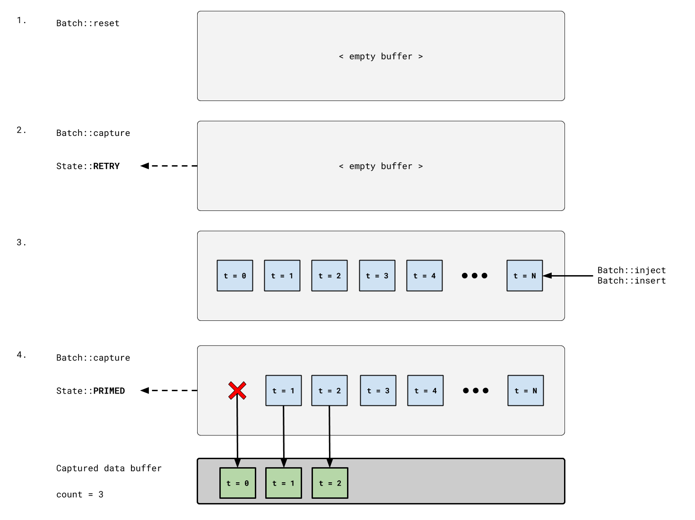


#### `flow::driver::Chunk`

Captures the next N-oldest available `Dispatch` elements, removing all which are captured. Capture range lower bound is the stamp associated with the oldest captured `Dispatch`. Capture range upper bound is the stamp associated with the oldest captured `Dispatch`.

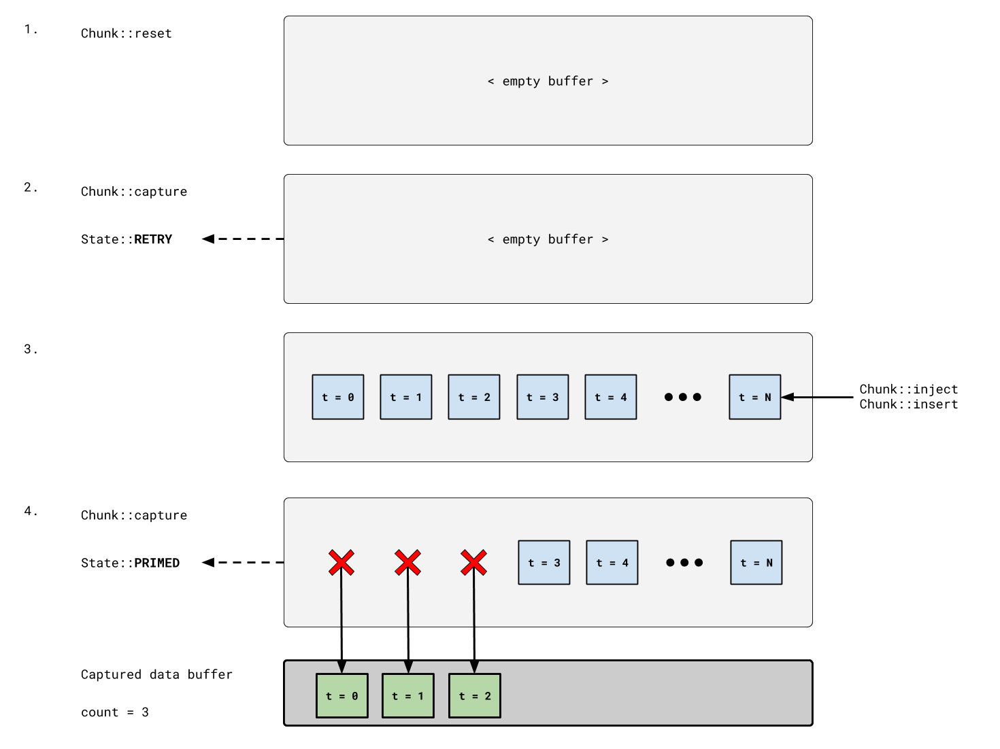


#### `flow::driver::Next`

Captures the oldest available `Dispatch` elements. Capture range is the stamp associated with that `Dispatch`.

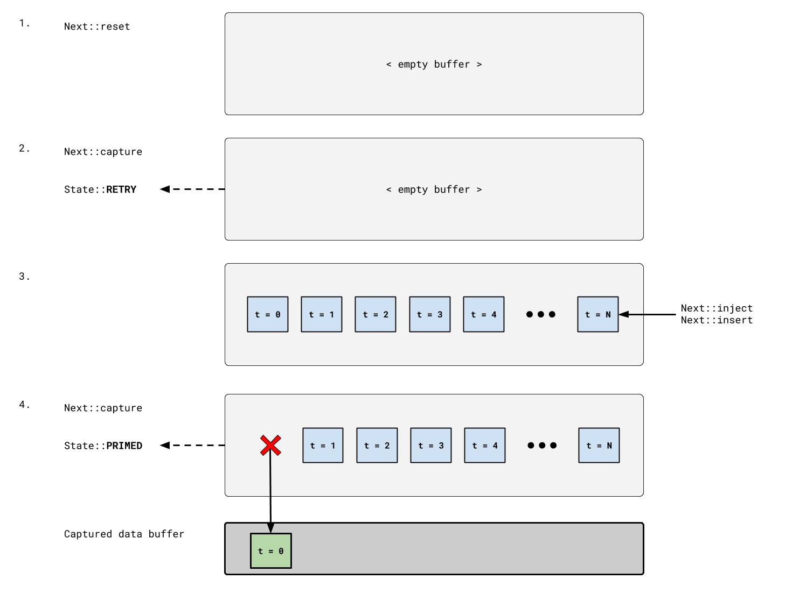


#### `flow::driver::Throttled`

Captures the oldest available `Dispatch` elements. Capture range is the stamp associated with that `Dispatch`.

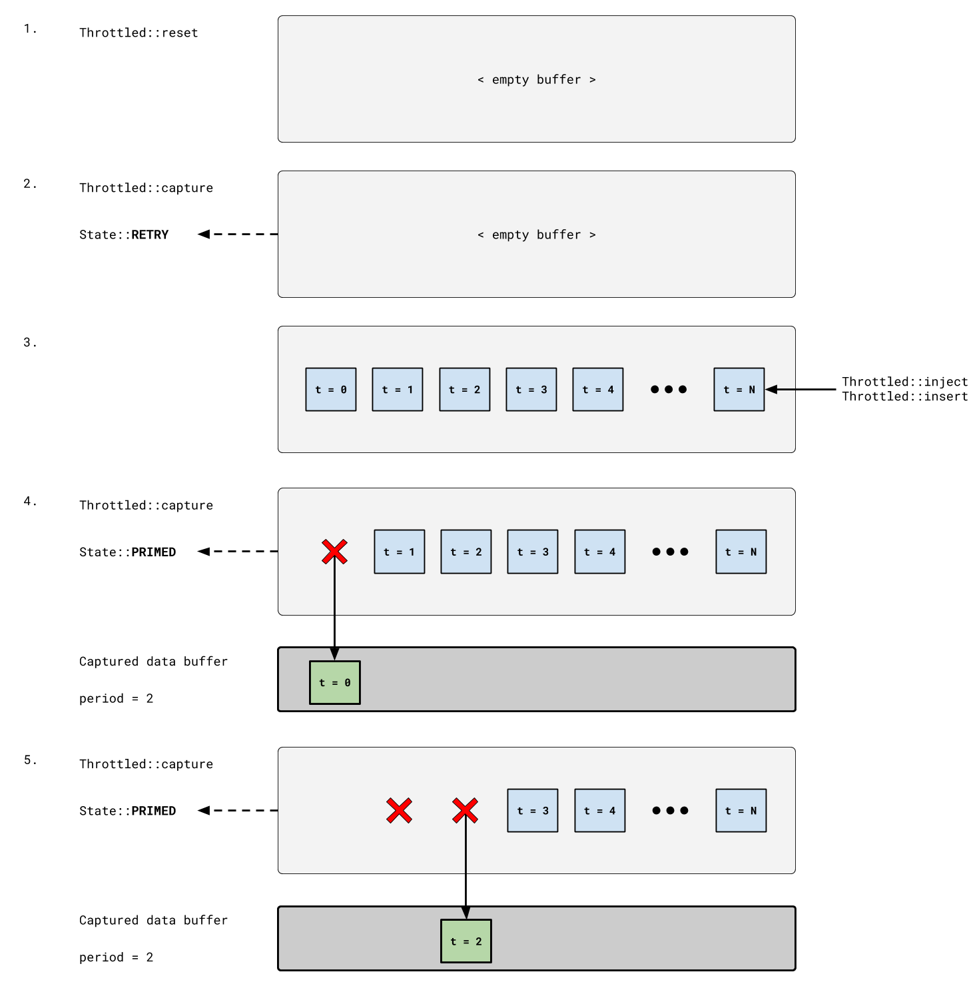


### Followers

#### `flow::follower::AnyBefore`

Captures all `Dispatch` elements before the capture range lower bound, minus a `delay` offset. All of the captured elements are removed. 

Capture will report a `flow::State::PRIMED` state even if the buffer is empty, making this captor the ideal choice if you are working with a data stream that is "optional" for the current synchronization attempt.

It should be understood that the data captured by this captor is largely dependent on how data is add to the buffer and when `capture` is called.


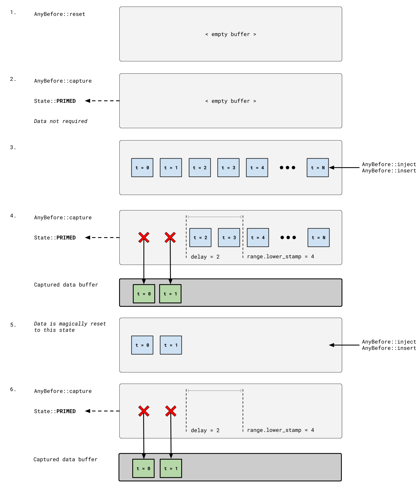


#### `flow::follower::Before`

Captures all `Dispatch` elements before the capture range lower bound, minus a `delay` offset, once at least a single element is available after said sequencing boundary. All of the captured elements are removed.

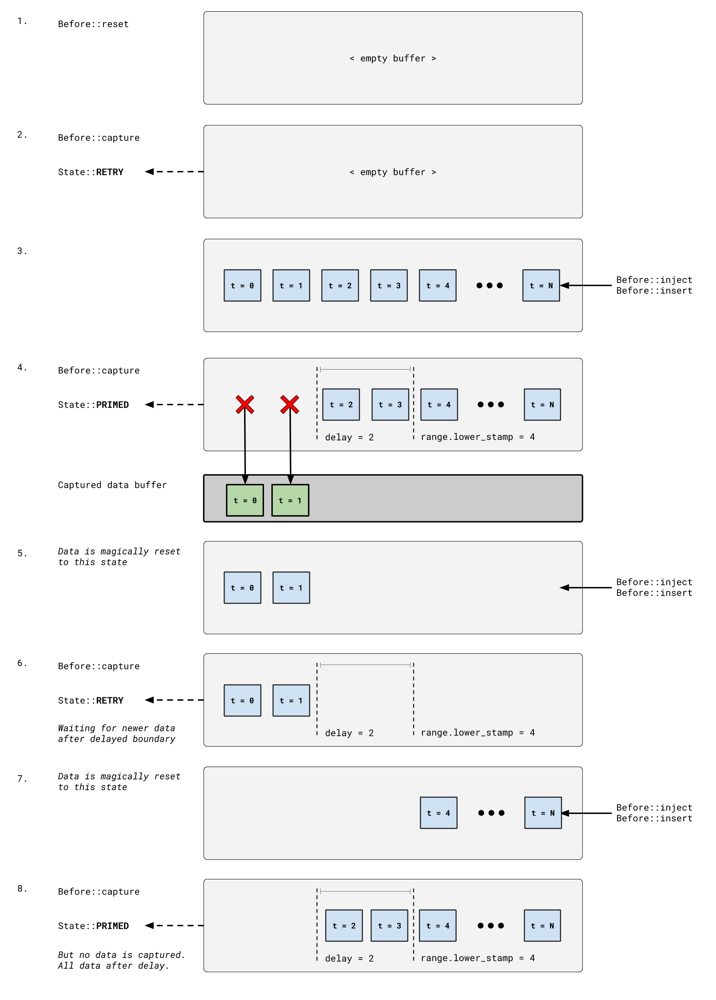


#### `flow::follower::ClosestBefore`

Captures one `Dispatch` element before the capture range lower bound, minus a `delay` offset, within a pre-configured data period. All older elements are removed.

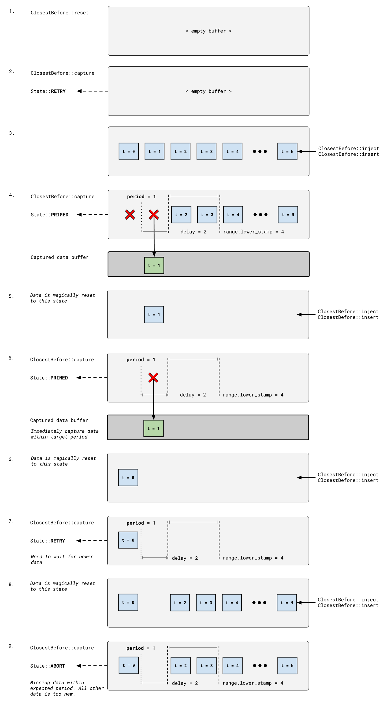


#### `flow::follower::CountBefore`

Captures N `Dispatch` elements before the capture range lower bound, minus a `delay` offset. All older elements are removed.

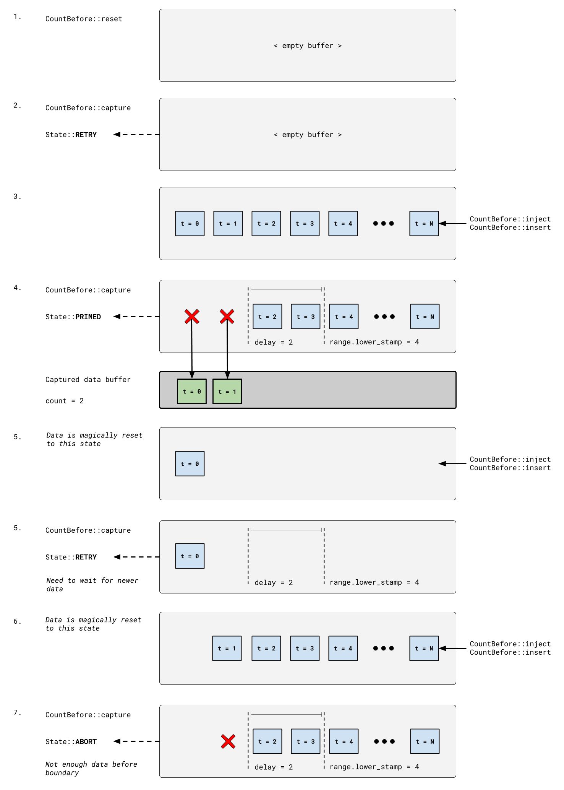


#### `flow::follower::Latched`

Captures one `Dispatch` element before the capture range lower bound, minus a minimum period. All older elements are removed. If no newer elements are present on the next capture attempt, then the last captured element is returned. If a newer element is present on a subsequent capture attempt, meeting the aforementioned qualifications, this elements is captured and replaces "latched" element state.

Latched element is cleared on reset.

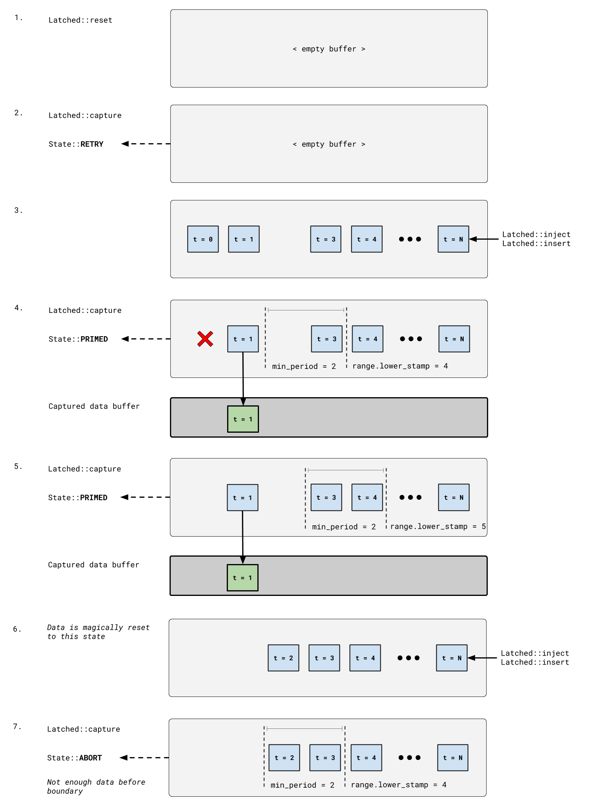


#### `flow::follower::MatchedStamp`

Captures one `Dispatch` element with a stamp which exactly matched the capture range lower bound. All older elements are removed.

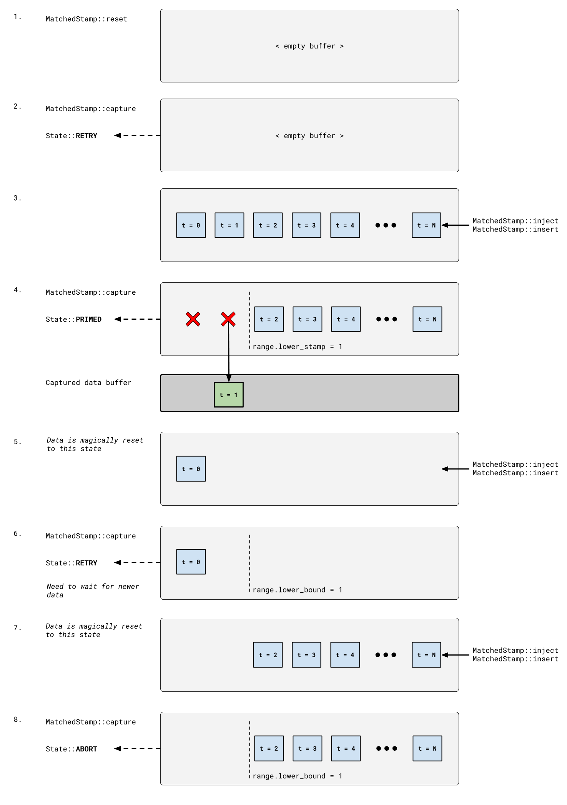


#### `flow::follower::Ranged`

Captures one `Dispatch` element before the capture range lower bound; one element after the capture range upper bound; and all elements in between. All older elements are removed.

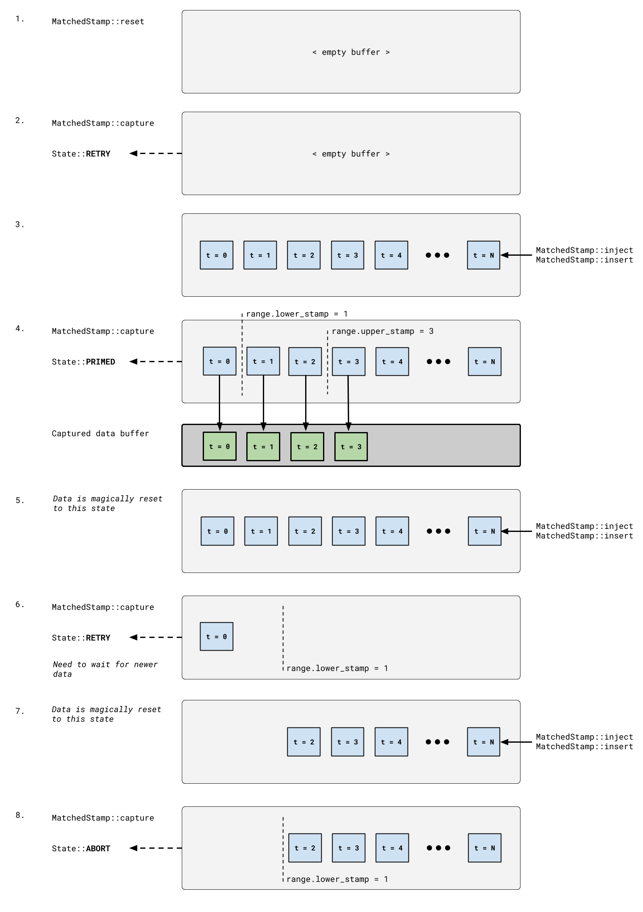


## Running Tests

```
bazel test ... --test_output=all
```

Bazel isn't everyone's cup of tea. _cmake build to come later_; earlier contribution welcome.

