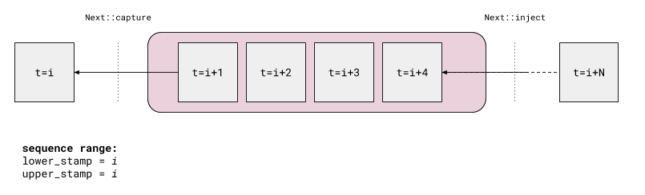
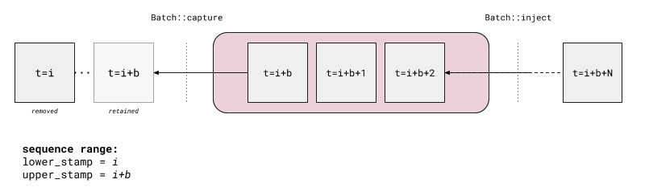
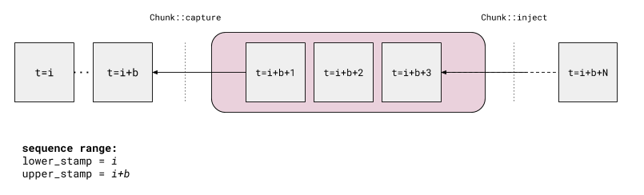
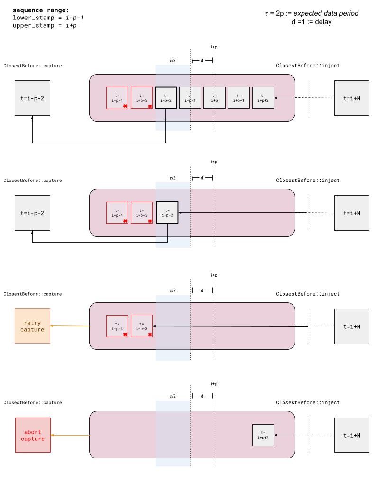
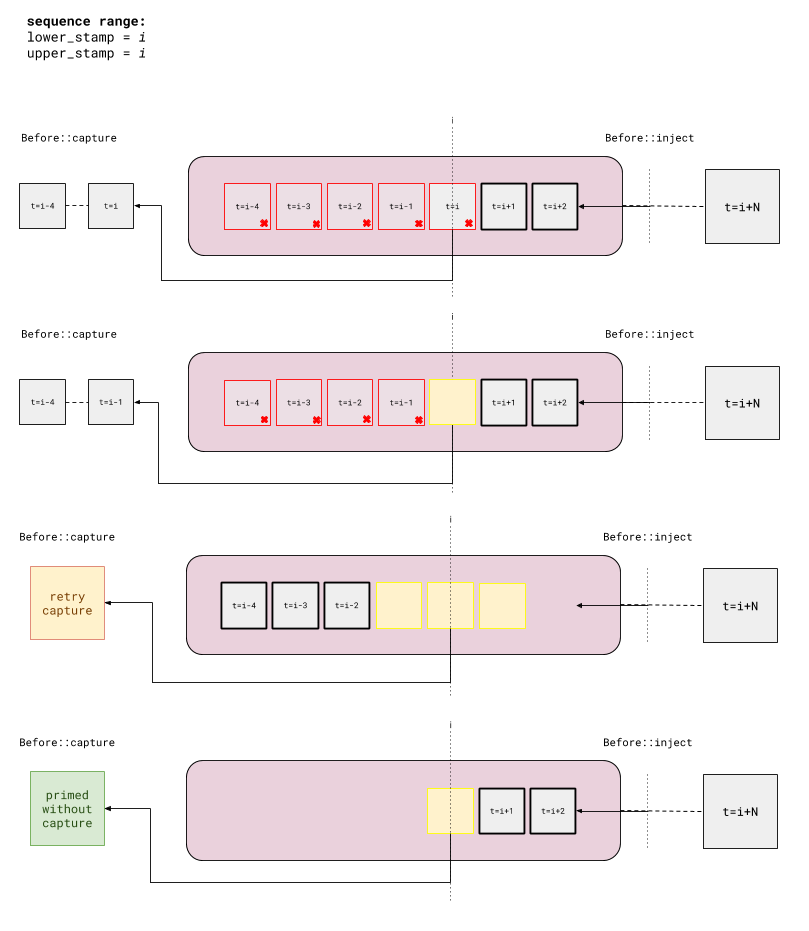
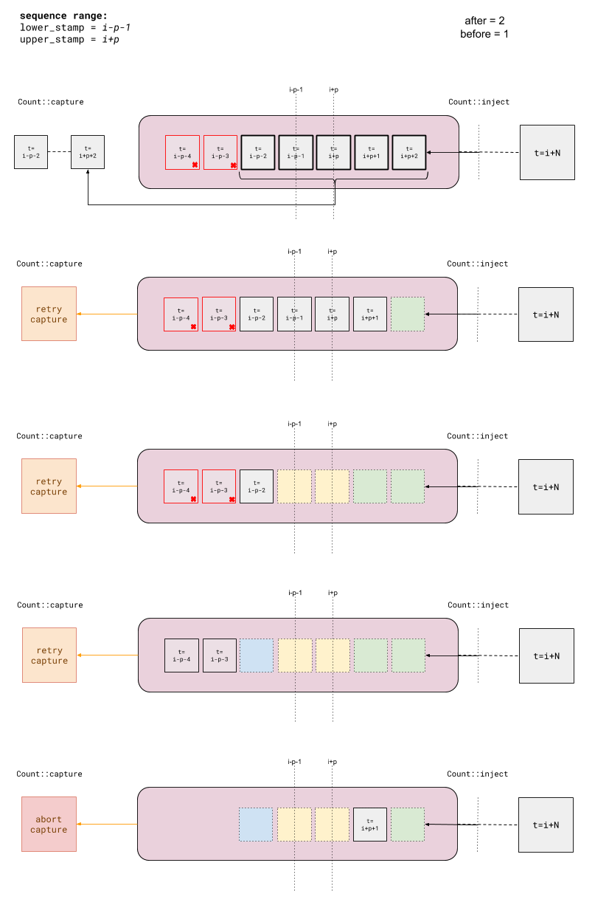

# Flow
This package defines a framework for data synchronization.

## Library provisions

The Flow library provides two core mechanisms:

- `flow::Captor`: data buffers with associated synchronization policies. `flow::Captor` objects fall into two categories:
    + `flow::Driver`: `flow::Captor` derivatives which gather data and generate sequencing stamps to serve as a basis for synchronizing _following_ inputs
    + `flow::Follower`: `flow::Captor` derivatives which define synchronization policies to capture buffered data with respect to _driving_ sequencing range
- `flow::Synchronizer` : manages `flow::Captor` objects and orchestrates data capture behavior to produce _data frames_. Data frames consist of data captured from 1 or more synchronized `flow::Captor` objects for a particular sequencing range.


## Data synchronization


### Dispatches

The core data element in Flow is a `flow::Dispatch`, which is essentially wraps a data payload and provides a method to access an associated sequencing stamp. Sequencing information accessible from `flow::Dispatch` is used to data in `flow::Captor` buffers and synchronizing data. Synchronized data is also returned to the user as a collection of `flow::Dispatch` objects so that sequencing information about captured elements is uniformly accessible.

`flow::Dispatch` objects which must provide the following accessor methods:

```c++
class Dispatch
{
  /// Accesses data sequencing stamp
  const stamp_type& stamp() const;

  /// Accesses an immutable reference to the data itself
  const value_type& data() const;

  /// Relational operators
};

```

`flow::DispatchTraits` are used to provide type information about `flow::Dispatch` objects used by `flow::Captor` objects, particularly sequencing stamp and data payload types. A simple `flow::Dispatch` template is provided which fulfills minimum accessor requirements, however, `flow::Dispatch` and their associated `flow::DispatchTraits` objects may be specialized per application.


## Captor

`flow::Captor` objects buffer data and manage data cleanup, removing data which is no longer relevant for subsequent synchronization attempts. `flow::Captor` objects are also designed to abort and remove stale data when data synchronization is not possible given currently available data.


### Non-threaded vs. threaded contexts

`flow::Captor` derivatives and `flow::Synchronizer`  objects are designed to work in both single and multi-threaded contexts. In a multi-threaded context, `flow::Captor` resources may be loaded with data (via `Captor::inject`) from multiple threads, and synchronization in an `flow::Synchronizer`  can happen in another.

# Drivers

`Driver`s are captors used to generate a base sequencing stamp range used when synchronizing inputs from `Follower` captors.

## Policies

________________


### `flow::driver::Next`

This captor will capture the next available buffered message. The next message selected for capture will always be the _oldest_ buffered message.



________________


### `flow::driver::Batch`

This captor will capture a window of the next _N_-available buffered messages and remove move the oldest from the queue. Note that these _N_ messages will always be ordered in time from oldest to newest. If incoming messages are naturally ordered in time then captured messages will appear as a sliding window. If this is not the case, then newer captured messages may be the same between capture attempts.




________________


### `flow::driver::Chunk`

Similar to the `flow::driver::Batch` policy implementation, an input channel using this policy will capture a sequence of the next _N_-available buffered messages. Unlike the `flow::driver::Batch` policy, this window will be completely discarded in whole after capture, instead of just the oldest element. Note that these _N_ messages will always be ordered in time from oldest to newest. If incoming messages are naturally ordered in time then captured messages will appear as a sliding window. If this is not the case, then newer captured messages may be the same between capture attempts.





-----------------


## Follower Policies

________________


### `flow::follower::ClosestBefore`




________________


### `flow::follower::Before`



________________


### `flow::follower::Count`

This captor will wait for _N_-messages before and _M_-messages after the capture driving data before becoming ready. If the driving input capture channel prepares a single data element on every update (e.g. one using the [`flow::driver::Next`](#next_policy) policy) then the messages captured by a counting channel will include _N_-messages older than and _M_-messages newer than the time stamp associated with the driving element. If the driving input capture channel prepares multiple data elements on every update (e.g. one using the [`flow::driver::Batch`](#batch_policy)), then the messages captured by a counting channel will include _N_-messages older than the _oldest_ captured driving element and _M_-messages newer than the _newest_ captured driving elements.




________________


### `flow::follower::MatchedStamp`


